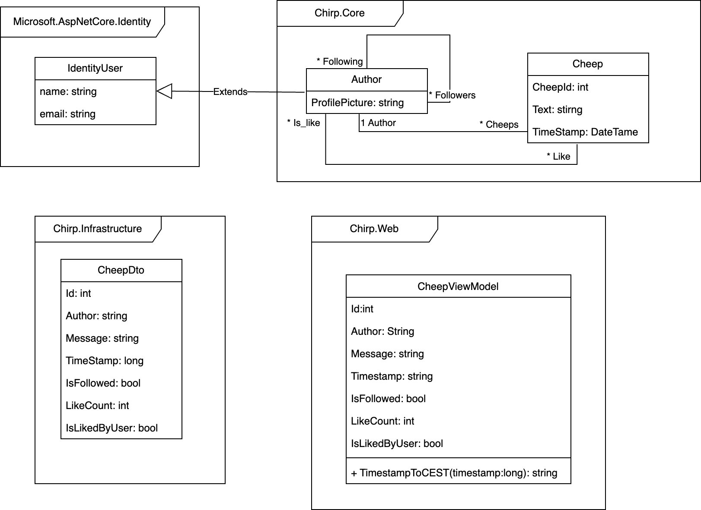
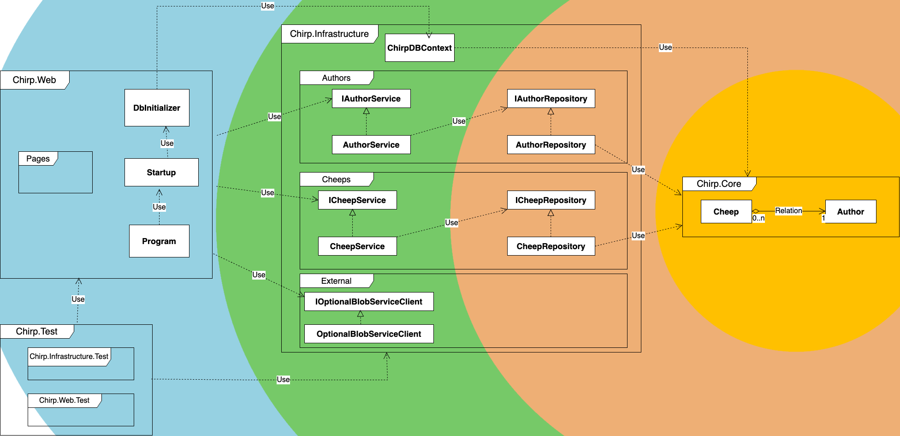
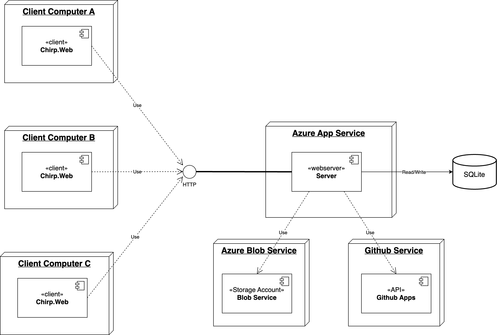
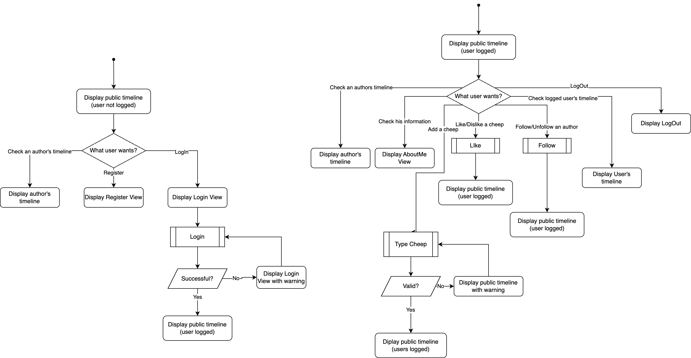
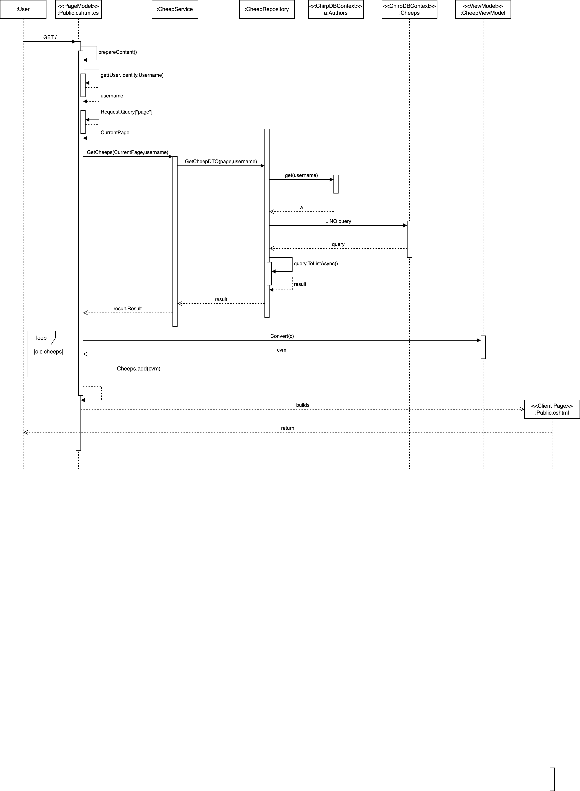
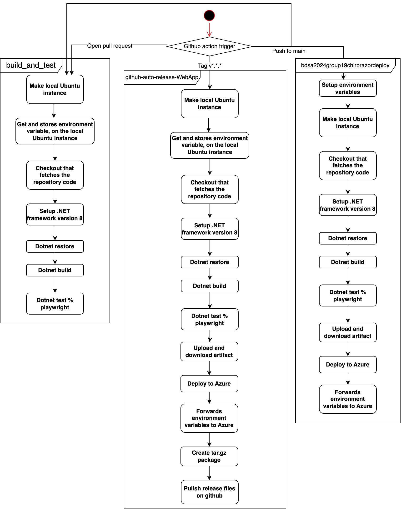
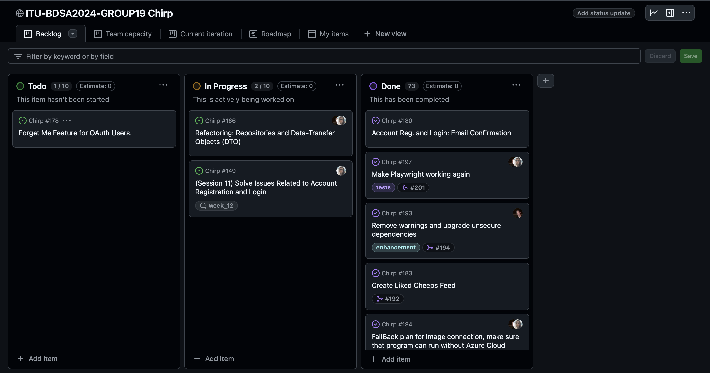
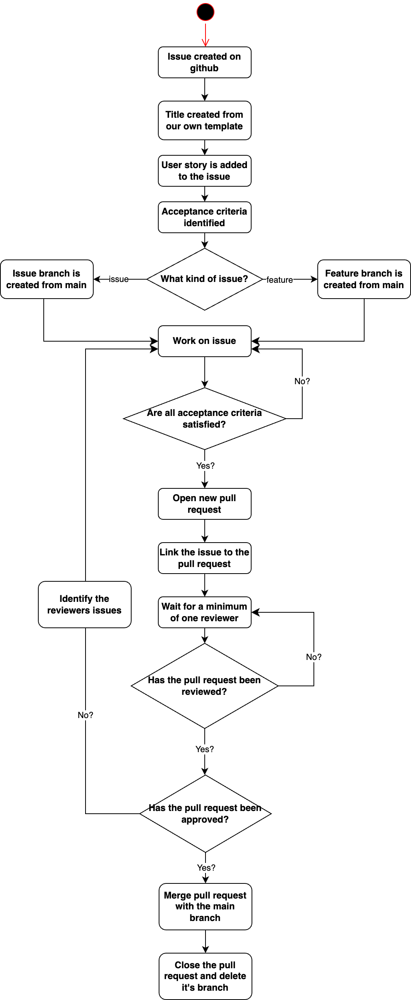

\pagebreak

# Design and Architecture of _Chirp!_

## Domain model

The two main entities of _Chirp!_ are `Author` and `Cheep`. 

- An `Author` represents one of our users. This type is implemented as an extension of the default `IdentityUser` type.[^1] Authors can follow each other on _Chirp!_ 
- A `Cheep` is a message posted to _Chirp!_ by an author. Additionally for this project, users are able to "like" Cheeps.

These entity types are saved to a database using _Enitiy Framework Core_.[^2] EF Core supports saving these entities in a relational database for the application, and is able to apply _migrations_ to this database as the entities change and features are added. 

In addition to the main entities, we have derived types for data transfer and page model types. 

Data transfer objects such as `CheepDto` are used where data leaves `Chirp.Infrastructure` for other services. In this way we have greater control over data leaving our infrastructure layer. Example: Each `Cheep` has an `Author` object reference to the writer. This entity has fields with email data, password hashes, etc. A `CheepDto` passed to another service only contains the author name and profile picture link.

Content preparation in `Chirp.Web` formats `CheepDto` data for web display as `CheepViewModel`. This allows `CheepDto` to be "reused" as a type for serving in other formats such as JSON.

[^1]: _IdentityUser Class Reference_ https://learn.microsoft.com/en-us/dotnet/api/microsoft.aspnetcore.identity.identityuser

[^2]: Andrew Lock, "ASP.NET Core in Action", Chapter 12: _Saving data with Entity Framework Core_, 3rd edition, 2023



\pagebreak

## Architecture — In the small

Below is an illustration of the organization of our code base.
We have implemented the 'Onion Architecture'. The four colours in the diagram refer to the four layers of the architectural pattern[^3].

Our code base is divided into three folders:

- `Chirp.Web` handles the outer UI layer. In this folder all code referring to displaying our application resides. This includes all Razor Pages and their respective models. As this is the outermost layer, `Chirp.Web` has knowledge of all architectural layers.
- `Chirp.Architecture` contains both the Service and Repository layer. This has been done to make the `Author` and `Cheep` service and repository pairs easily accessible. The services depend on the repositories, and the repositories depend on the entity classes in `Chirp.Core`.
- `Chirp.Core` only contains the two Domain Entities `Author` and `Cheep`. Hence `Chirp.Core` has no knowledge of any other layers.

The diagram shows that our code base only has inward dependencies, in compliance with the 'Onion Architecture'. Thereby no inner layer has any knowledge of outer layers.


 
[^3]: _Colouring of the 'Onion Architecture' inspiration_ https://raw.githubusercontent.com/itu-bdsa/lecture_notes/refs/heads/main/sessions/session_07/images/onion_architecture.webp

\pagebreak

## Architecture of deployed application

The class diagram below shows how the architecture of _Chirp!_ looks when deployed. It is a client-server application where clients connect to a webservice through HTTP. 
All of the HTTP GET/POST requests are then handled by Azure App Service using an SQLite database.
The webserver depends on two services that handles different core components in our program. The first one is the Blob Service which is based in the Azure environment. Blobs are defined as unstructured data or files, which in our case is the users profile pictures.
The second one is an external API provided by Github. This API makes third party authentication possible through webservice calls, that provide authentication tokens for our login process.



\pagebreak

## User activities

The illustration below shows two user journeys. The first one shows the journey of a non-authorized user, and the second one shows what becomes available when the user has logged in, and thereby becomes authorized. 

We can se that the actions that change the website are only available to authorized users. This includes the ability to post a Cheep, follow other users, and like Cheeps.



\pagebreak

## Sequence of functionality/calls trough _Chirp!_

The sequence diagram below illustrates the sequence of messages and data needed to render the entire public timeline for a non-authorized user.
The sequence starts with the user loading the application thereby sending a HTTP GET request. The diagram ends with a fully rendered public timeline returned to the user.

The LINQ query returns a `Task<List<CheepDTO>>` that is convert to a `<List<CheepDTO>>` and then finally tranformed the result to a `List<CheepViewModel>` with the loop.



\pagebreak

# Process

## Build, test, release, and deployment

Below is an illustration of how our two workflows interact with different github action triggers.

We have three workflows:

- _`build_and_test`_ makes sure the program builds and tests locally.
- _`github-auto-release-WebApp`_ handles new releases of _Chirp!_, and deploys them to Azure
- _`bdsa2024group19chirprazordeploy`_ handles deployment to Azure.

If a pull request is triggered our _`build_and_test`_ workflow is activated.
If a tag is added to the main branch the _`github-auto-release-WebApp`_ is triggered
If a push to main is triggered both the _`build_and_test`_ and _`bdsa2024group19chirprazordeploy`_ workflows are activated sequentially.
All of our workflows run on a local Ubuntu instance, that is created at the start of the workflow.
All the workflows checks out our code base, sets up .NET8 and runs a dotnet restore, build and test.
The deployment and release workflow then deploys the newly build application to Azure. Finally the release workflow creates a new github release with the necessary files.



\pagebreak

## Team work

### What tasks remain unresolved

All features for the _Chirp!_ application have been completed. The last unresolved tasks are refinements that would have been nice to have for a smoother user experience.


These include:

- The ability for users logged in through GitHub, to delete their account without creating a password.
- Small refactorings, enabling easier readability of our code base.

As for our test suite, testing for the `AuthorRepository` and the forget me feature have not been completed. Our playwright tests only works locally, so we filtered them out of our GiHhub workflows. In addition a larger playwright test suite would have been ideal as more edge case UI errors would have been detected sooner.



### Our development workflow

When a new task arises, an issue is created on github using it's build-in ticket system.

The issue is then created based on a set of rules shown in our `README.md` file, including:

- Issue Title Format: "('Session week number', 'issue number') 'Title of the issue at hand'"
- User Story Format: "As a (user type), I want to (task) so that (goal)." (Please write in issue description)
- Acceptance Criteria: Follow a point format of the intended outcomes of the issue.

After the issue has been created, a development branch is added. If we identify the task as a feature, the branch name has the prefix _feature/_, thereby creating a feature directory.
Otherwise the prefix should be _issue/_.
Afterwards, development begins and runs iteratively until all acceptance criteria are satisfied.
If the developer thinks the task is done, they create a pull request.
If another group member believes changes are necessary, a new development cycle begins.
The contents are only pushed to main when the pull request gets a minimum of one approval.



\pagebreak

## How to make _Chirp!_ work locally

### How to run the project from source code 

- The project can simply be run locally using the `dotnet run` command from the Chirp.Web directory in the terminal.

- Environment variables for the database connection string and the Azure storage connection string depends on if you run the sourcecode directly, which is seen as development state, or not. If not in development state, environment variables are needed to be set.
- If in development state, database will be stored directly in memory and the default stock image will be shown, instead of those provided by the Azure cloud storage. Environment variables are not needed to be set, but can still be set for the enhanced experience in development state.

Examples of these environment variables are: 

```bash
export CHIRPDBPATH=":memory:"
export CHIRPDBPATH="/Temp/db.db"
export AZURE__STORAGE__CONNECTION__STRING="DefaultEndpointsProtocol=https;
AccountName=chirpstorage;AccountKey=yourkey;EndpointSuffix=core.windows.net"
```

- Warnings of deprecated or old dependencies can be fixed by deleting old packages from the running machines NuGet cache. This can be done by running `dotnet nuget locals all --clear` in the terminal. Or manually deleting the packages from `C:\Users\<INSERT_YOUR_OWN_USERNAME>\.nuget\packages` and delete the packages that are no longer needed.
- Example of this issue could be the `.nuget\packages\system.text.json` that is being relied on in the project by the package Azure.Storage.Blobs. This states that System.Text.Json version 6.0.10 or greater is needed, but this allows for packages that are older and have warnings and secuirity issues.


### How to run the published program
 
- Download the .tar.gz file from the release page on GitHub. This is a release for Linux x64.
- Extract the published program to a directory.
- The project can be run by executing `Chirp.Web` in the bash terminal set to the release directory.
- It is mandatory to set the environment variable `CHIRPDBPATH` to the SQLite database location. Optionally set the Azure Blob Storage and GitHub OAuth variables.
- Setting `CHIRPDBPATH` to `":memory:"` will run _Chirp!_ with an in-memory database and sample user data. 
- For persistent user data, set `CHIRPDBPATH` to the path for a database file. E.g. `/chirpdata/chirp.db`. The database will automatically be created if it does not exist, but the directory must exist.

Examples of these environment variables are: 

```bash
export CHIRPDBPATH=":memory:"
export CHIRPDBPATH="/Temp/db.db"
export AZURE__STORAGE__CONNECTION__STRING="DefaultEndpointsProtocol=https;
AccountName=chirpstorage;AccountKey=yourkey;EndpointSuffix=core.windows.net"
```

## Test suite

### How to run test suite locally

With a terminal open in the project root, the test suite can be run using the command "`dotnet test`". Integration tests and end-to-end tests run the app locally using an in-memory database. 

- Regular unit tests and integration tests are known to work on all platforms. These tests are integrated into our workflow on GitHub. 
- Playwright tests can run locally. A test fixture has been incorporated to help setup Playwright on new machines.[^4] The test fixture has been used successfully on Windows machines. There are still problems running these tests on Linux and OSX platforms. 

[^4]: Xavier Solau, https://github.com/xaviersolau/DevArticles/tree/e2e_test_blazor_with_playwright, 2022

### Our tests
In our test suite, we have created Unit tests for the `CheepRepository`and `CheepService`.
These tests are run on a repository stub imitating the real `CheepRepository`.
The Unit tests, test most methods in both the `CheepService` and `CheepRepository`.

Furthermore we have created different End-to-End UI tests, using the Playwright framework, that focus on checking that the _Chirp!_ website runs as intended.

This includes:

- Testing against XSS attacks.
- Testing that the authentication works as intended.
- Testing that the website displays cheeps as intended.

Lastly, we have an integration test, making sure SQL injection attacks can not happen.
Although not all aspects of the application are tested, we tested what we deemed most important, making sure to use and learn all the testing frameworks that were provided.

# Ethics

## License

We have chosen to release our project under the MIT License. Anyone can use the project for any purpose, provided that the license and our mark is retained with the work. We accept no liability and provide no warranty for such use. 

To adopt this license, we first looked at any dependencies that our project had. Namely the Microsoft `.nuget` packages released under the MIT license, as well as other third party tools such as `Moq` released under the BSD-3 license. The dependencies we identified do not place restrictions on our project source release through their licensing. 

An important reference for an overview of software licensing options in the open source community has been `https://choosealicense.com/`. Insight into the importance of licensing for promoting competition and continued development was promoted by attending a guest lecture on the subject by Martin von Haller Grønbæk at ITU.[^5]

[^5]: Martin von Haller Grønbæk, "Guest lecture on Software Licenses" (lecture, ITU, Copenhagen, October 9, 2024).

## LLMs, ChatGPT, Copilot, and others

### ChatGPT
We have tried not to rely on services such as ChatGPT. We found that it often lacks the perspective required to write code that adheres to most common programming principles.

However, there are cases where ChatGPT has been used. Here are some key examples:

- Throughout the project, ChatGPT has in some cases been used for added inspiration. Provided "solutions" to issues were not satisfactory, but did provide insight into how we would solve these issues ourselves. However in the time it took to get to a helpful answer, we could have just as easily found help somewhere else.
- In the first stages of the project, it was a useful tool for installing software correctly. 
- It proved quite useful when setting up the connection between Azure and GitHub OAuth. The instructions provided in the course material did not reflect the current state of the Azure website.
- When receiving error messages of considerable length, it was good at translating these to a more readable form.

### Copilots

Several IDE's have been in use during the project, namely Visual Studio 22, Visual Studio Code, and Jetbrains Rider. By default, Rider has a built-in feature called IntelliSense, that adds suggestions to complete statements.

IntelliSense has been used often, although many of its autocomplete suggestions have been ignored, as much like ChatGPT, it does not always understand the context of the environment, and thus has a tendency to provide inapplicable suggestions.

The use of IntelliSense has also been extended with GitHub Copilot, an extension for Rider. This service provides optimized autocomplete suggestions, to improve on IntelliSense.

No other LLM's have been used during the project.
